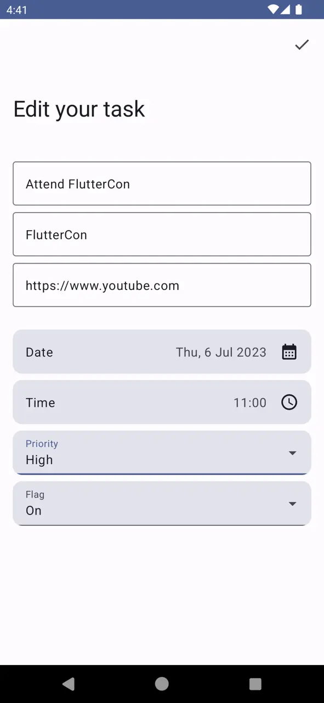

# MakeItSo (Material 3)

Building an Android app with Jetpack Compose and Firebase - The Firebase Blog.

The app we are going to build here is called Make It So. It’s a simple to-do
list application that allows the user to add and edit to-do items, add flags,
priorities and due dates, and mark the tasks as completed.

This is the final (modified) app of the series that dive into creating a new
Android application from scratch using Jetpack Compose for the user interface
and some other tools offered by Google, like Firebase Authentication,
Crashlytics, Cloud Firestore and Hilt.

[Start Tutorial](https://firebase.blog/posts/2022/04/building-an-app-android-jetpack-compose-firebase)
at Firebase Blog.

## Preview

 
 
 
 

## Using Firebase Emulators

```console
firebase emulators:start --import=local --export-on-exit=local
```

## Connecting Firebase Emulator to Android Emulator

`10.0.2.2` is the special IP address to connect to the `localhost` or
`127.0.0.1` of the host computer from an Android emulator.

```kotlin
FirebaseAuth.getInstance().useEmulator("10.0.2.2", 9099)
FirebaseStorage.getInstance().useEmulator("10.0.2.2", 9199)
FirebaseFunctions.getInstance().useEmulator("10.0.2.2", 5001)
FirebaseFirestore.getInstance().useEmulator("10.0.2.2", 8080)

// Disable cache
FirebaseFirestoreSettings settings = new FirebaseFirestoreSettings
    .Builder().setPersistenceEnabled(false).build()
FirebaseFirestore.getInstance().setFirestoreSettings(settings)
```

## Extras

Sometimes the port remains occupied in case of abnormal process termination, to
find and close the process use the below pair of commands.

```console
lsof -i tcp:port
kill [-15|-3|-9] pid
```
